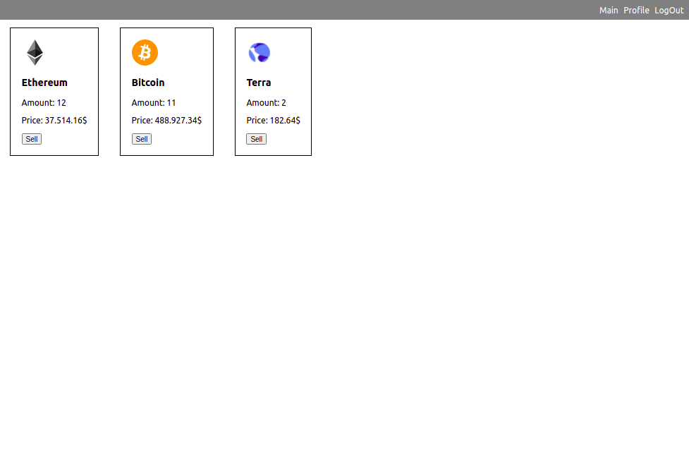

# Nomics Cryptocurrency API

Using Nomics Cryptocurrency & Bitcoin API with Reactjs(styled components) and firebase for storage.
Basic GET/POST/PUT/DELETE methods.

#### https://nomics.com/docs/ 

### Register and login to remove top red alert bar

### You can login with username: guest@abv.bg password: 123123

### Click on the coin you want to buy and enter the amount then press buy

### Look at your collection of coins at the profile page

